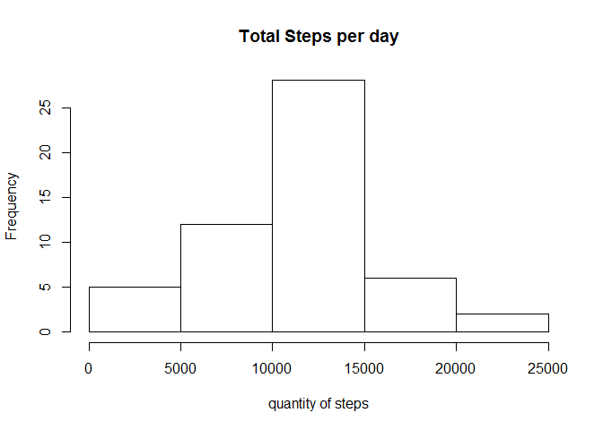
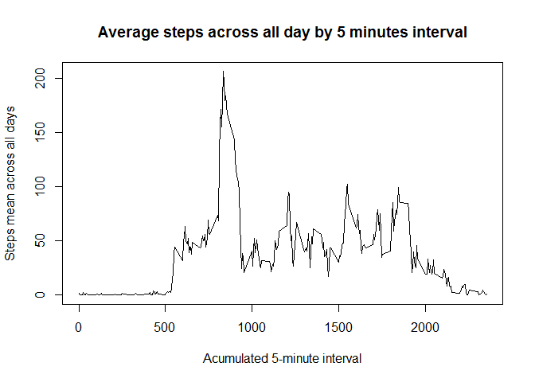
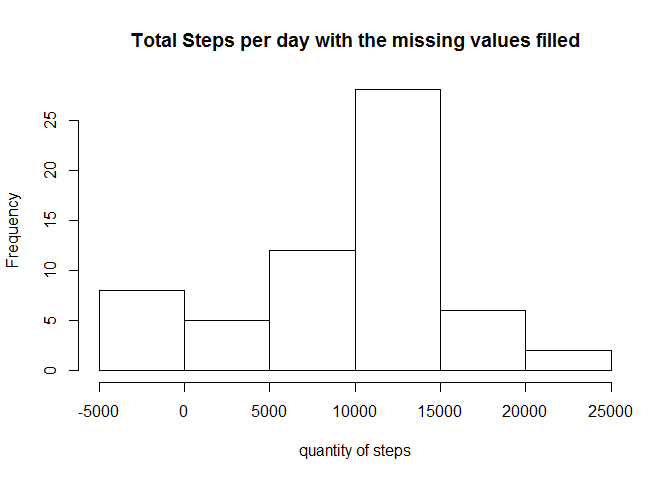
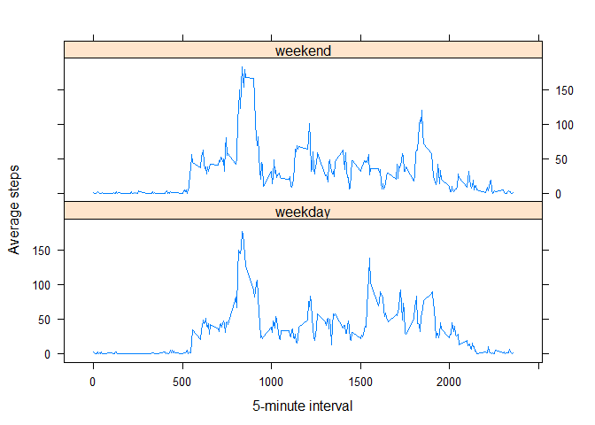

# Reproducible Research: Peer Assessment 1

## Data characteristics
This assignment makes use of data from a personal activity monitoring device. This device collects data at 5 minute intervals through out the day. The data consists of two months of data from an anonymous individual collected during the months of October and November, 2012 and include the number of steps taken in 5 minute intervals each day.
The data can be downloaded from the course web site:
- Dataset: [Activity monitoring data](https://d396qusza40orc.cloudfront.net/repdata%2Fdata%2Factivity.zip)  
For this assignment I downloaded the data at January 09, 2016.  
The variables included in this dataset are:  
- steps: Number of steps taking in a 5-minute interval (missing values are coded as NA)  
- date: The date on which the measurement was taken in YYYY-MM-DD format  
- interval: Identifier for the 5-minute interval in which measurement was taken  

The dataset is stored in a comma-separated-value (CSV) file and there are a total of 17,568 observations in this dataset.  
The R script was write to read the Dataset directly from the web, but you can download and unzip to the working directory.  


## Loading and preprocessing the data

```r
data <- read.csv(unz("C:/Users/Ennio/Documents/GitHub/RepData_PeerAssessment1/activity.zip", "activity.csv"), header=T, stringsAsFactors=F, check.names=F)
data$date <- as.Date(data$date, format="%Y-%m-%d")
str(data)
```

```
## 'data.frame':	17568 obs. of  3 variables:
##  $ steps   : int  NA NA NA NA NA NA NA NA NA NA ...
##  $ date    : Date, format: "2012-10-01" "2012-10-01" ...
##  $ interval: int  0 5 10 15 20 25 30 35 40 45 ...
```

## What is mean total number of steps taken per day?

```r
bydate <- aggregate(steps ~ date, data = data, FUN = "sum", na.rm=T)
```
#### Histogram of the total steps

```r
hist(bydate$steps, main = "Total Steps per day", xlab = "quantity of steps")
```

\
  
Median of the total steps taken per day:

```r
median(bydate$steps)
```

```
## [1] 10765
```
Mean of the total steps taken per day:

```r
mean(bydate$steps)
```

```
## [1] 10766.19
```

## What is the average daily activity pattern?
#### Plotting the 5-minute interval and the average number of steps taken across all days

```r
by5min <- aggregate(steps ~ interval, data = data, FUN = "mean", na.rm=T)
plot(y = by5min$steps, x = by5min$interval, type = "l", main = "Average steps across all day by 5 minutes interval", xlab="Acumulated 5-minute interval", ylab="Steps mean across all days")
```

\
5-minute interval wich contains the maximum average steps:

```r
by5min$interval[which.max(by5min$steps)]
```

```
## [1] 835
```

## Imputing missing values
Counting the missing values:

```r
sum(is.na(data$steps))
```

```
## [1] 2304
```
I use the polynomial interpolation to fill the missing values on the "zoo" package to create a new dataset:

```r
require(zoo)
```

```
## Loading required package: zoo
```

```
## 
## Attaching package: 'zoo'
```

```
## The following objects are masked from 'package:base':
## 
##     as.Date, as.Date.numeric
```

```r
newdata = data
newdata$steps <- na.spline(newdata$steps)
```
#### Histogram of the total steps for the missing values filled in

```r
newbydate <- aggregate(steps ~ date, data = newdata, FUN = "sum", na.rm=T)
hist(newbydate$steps, main = "Total Steps per day with the missing values filled", xlab = "quantity of steps")
```

\
Mean for the new data:

```r
mean(newbydate$steps)
```

```
## [1] 9349.042
```
and the median:

```r
median(newbydate$steps)
```

```
## [1] 10395
```
So, filling the missing values with the polynomial interpolation reduces the mean and the median of the total number of steps.


## Are there differences in activity patterns between weekdays and weekends?
Creating a new data including weekdays and weekends:

```r
newdata$week <- lapply(newdata$date, function(x) if ( weekdays(x, abbreviate=T)<"sat" )
                        {return("weekday")} else {return("weekend")})
newdata$week <- unlist(newdata$week)
```
#### Plot by 5-minutes mean aggregated:

```r
newby5min <- aggregate(steps ~ interval+week, data = newdata, FUN = "mean", na.rm=T)
library(lattice)
xyplot(steps ~ interval | week, data=newby5min, type = "l", layout = c(1, 2), xlab="5-minute interval",ylab="Average steps")
```

\
